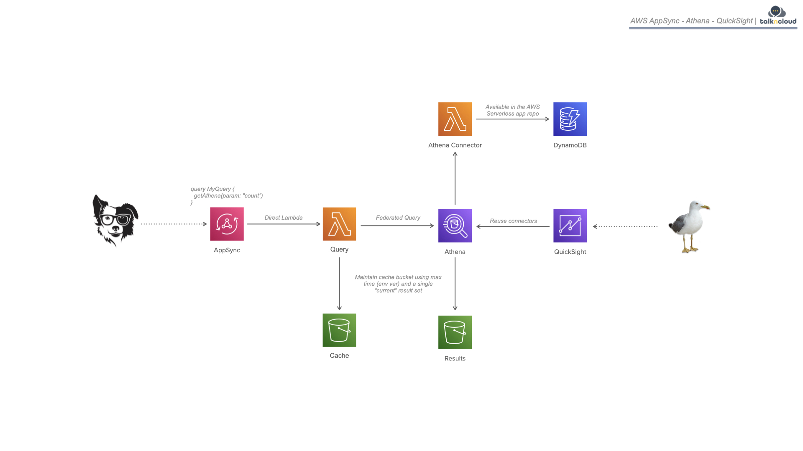
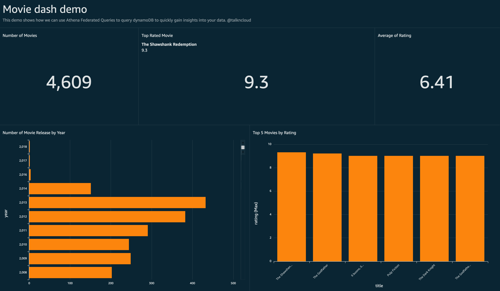
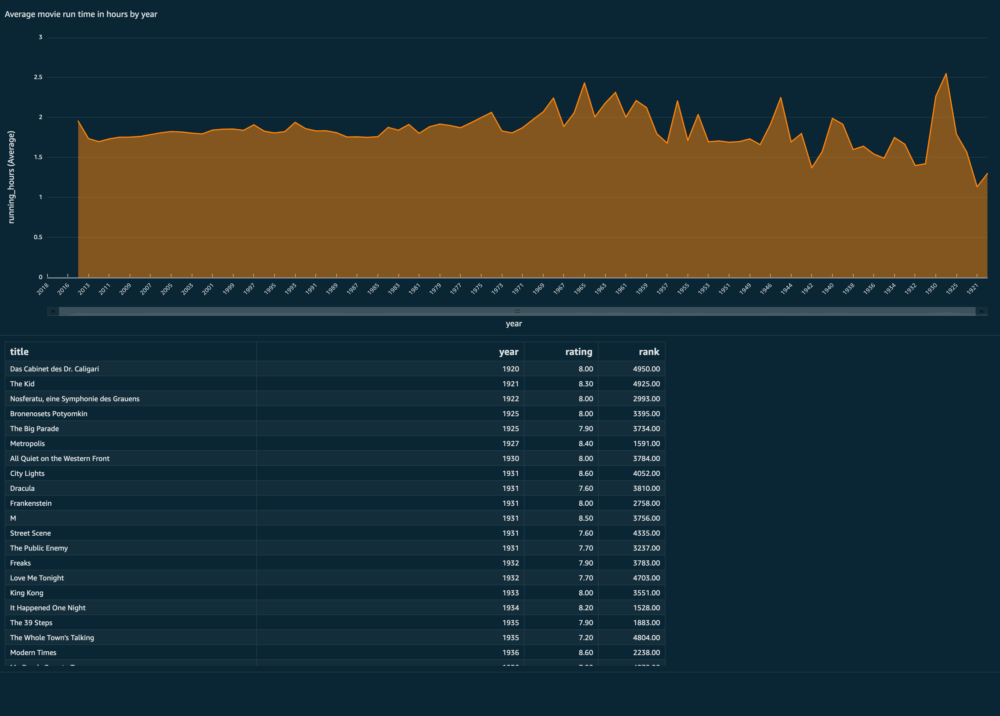

# Welcome to talkncloud CDK TypeScript project!

This example was developed to provide an example of athena federated queries with appsync, athena, dynamodb and quicksight. This provides an example on how to easily query dynamodb data and create dashboards.

Detailed info: https://www.talkncloud.com/athena-dynamodb-quicksight-cdk/

Example dashboard from this demo:

## General
Discuss it, change it, improve it, share it...

The `cdk.json` file tells the CDK Toolkit how to execute your app.

## Useful commands

 * `npm run build`   compile typescript to js
 * `npm run watch`   watch for changes and compile
 * `npm run test`    perform the jest unit tests
 * `cdk deploy`      deploy this stack to your default AWS account/region
 * `cdk diff`        compare deployed stack with current state
 * `cdk synth`       emits the synthesized CloudFormation template

## Usage
cdk deploy

## DynamoDB dummy data
Use the following to load sample data or your own: https://docs.aws.amazon.com/amazondynamodb/latest/developerguide/GettingStarted.NodeJs.02.html#GettingStarted.NodeJs.02.01

## Cost Estimates (tcup)
tcup: https://github.com/talkncloud/tnc-cup-client - AWS cost estimation for cloudformation templates

RAW cost estimation can be found here: [cost estimate](AthenaAppsyncStack.tcup.txt)
