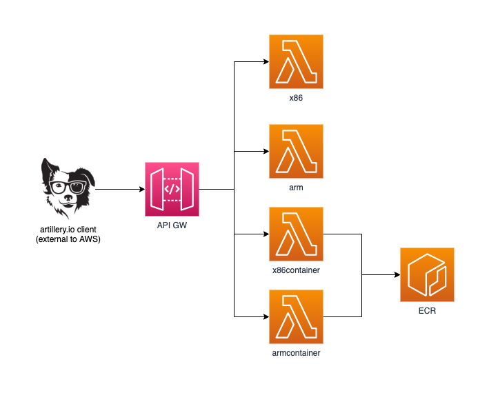

# Welcome to talkncloud CDK TypeScript project!

This example was developed to provide performance testing of the new Graviton2 arm support for AWS Lambda functions.

Detailed info: https://www.talkncloud.com/lambda-graviton2-now-you-can-have-slower-functions/



## Usage
yarn install

projen

projen deploy

## Grab your API-Key
You'll need a key to hit the API-GW, one is created during provisioning. Grab the key on the console or use the AWS CLI:

```
aws apigateway get-api-keys --query 'items[?name==`tnc-key`].value' --include-values --output text
```